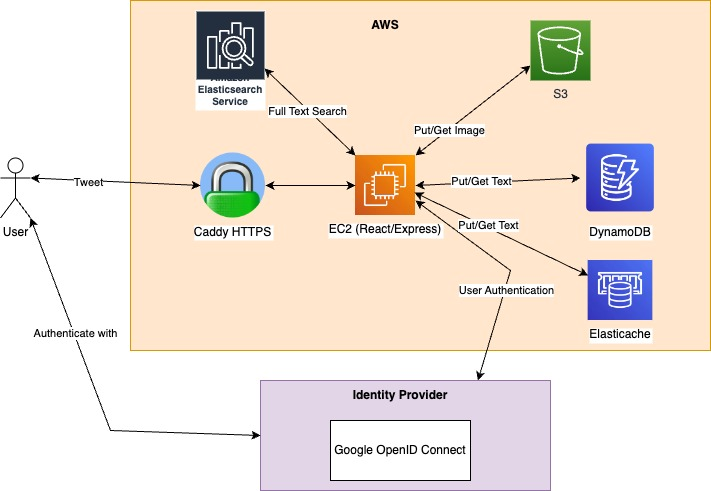
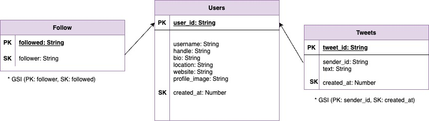
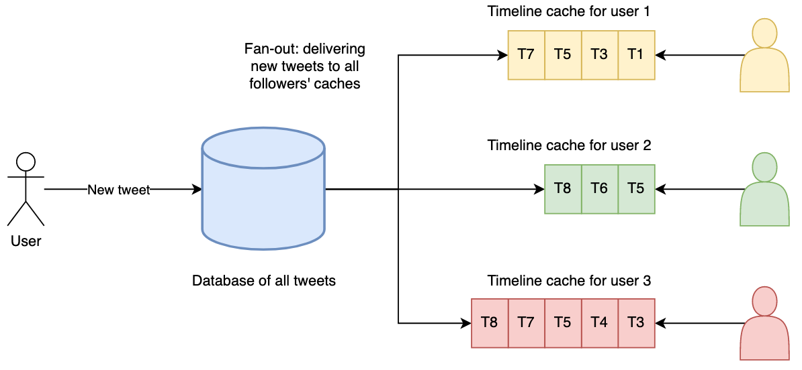

This is a Twitter clone implemented in Typescript!

# Architecture

## Functional Requirements

- Post a new tweet, which can include not only text but also images and URLs
- View one's own profile and the profile of other users
- Follow and unfollow users
- Get a personal feed to view every tweet from the authenticated user and the users that they follow
- View all tweets regardless if you follow that user or not

## Non-functional requirements

- High scalability with minimum latency

## Implementation

- Language: Typescript
- Frontend: React, Next.js, Material UI
- Backend: Express
- Auth: SSO using OIDC
- Storage: DynamoDB as the main data store, Elasticache for speeding up reads, S3 to store images

## UI/UX

#### Profile Page

The profile page contains all user information, from top to bottom:

- the user icon on the top left together with a default background image
- the username and handle
- the bio, which the user can use to introduce him or herself,
- the location of the user, the link to the personal website (if added) and when the account was created
- the following and followers count

On the top right corner is an "Edit Profile Button" if the profile corresponds to the authenticated user, or a "Follow/Unfollow" Button. The following and followers count link to the Followers/Following Page of that user.

Below the user information, all of the user's tweets are displayed. We can change the username, bio, location, website link, profile and background image.

#### Followers/Following Page

On top of the page are two tabs to either show the list of users that follow the authenticated user or the ones that the user follows.

The displayed list is made up of User Cards, that display the profile icon, name, handle and the user's bio. Clicking on the user card leads to the corresponding profile page.

#### Home Page

This is the main page of the web app. It has two tabs that allows to toggle between displaying the personal feed (tweets of the people we the user follows) or the global feed (all tweets). This requires infinite scrolling. Tweets are displayed as Tweet Components, showing the username and handle, when the tweet was posted and its content.

#### Header

The Header contains the twitter logo in the middle and the profile icon linking to the profile and a tweet button in the top right corner. Clicking on the tweet button opens a modal for writing tweets.

## API

- Posting a tweet: POST /tweets
- Retrieving the global feed: GET /tweets
- Retrieving the personal feed: GET /tweets/:userId
- Read profile information: GET /users/:userId/profile
- Update profile information: PATCH /users/:userId/profile
- Follow a user: PATCH /users/:userId/follow
- Unfollow a user: PATCH /users/:userId/unfollow

## Database Design

The application is read-heavy. We use a cache to speed up reads.

Operations:

- Post Tweet: A user can publish a new message to their followers (4.6k requests/sec on average, over 12k requests/sec at peak)
- View personal news feed: A user can view tweets posted by the people they follow (300k req/sec)

Use a personal feed cache: When a user posts a tweet, look up all the people who follow the user and insert the new tweet not only in the Tweets Table, but also into each of their personal feed caches. The request for the personal feed is then cheap, because it got precomputed.

For a small number of users with a lot of followers. it is too expensive to populate the caches of millions of users. Therefore, their tweets need to be fetched separately, so posting the tweet simply inserts it in the global database of tweets. In order for a user to know which of his followed accounts he needs to fetch separately, he can query the Follow Table for entries with the celebrity attribute set to true.

