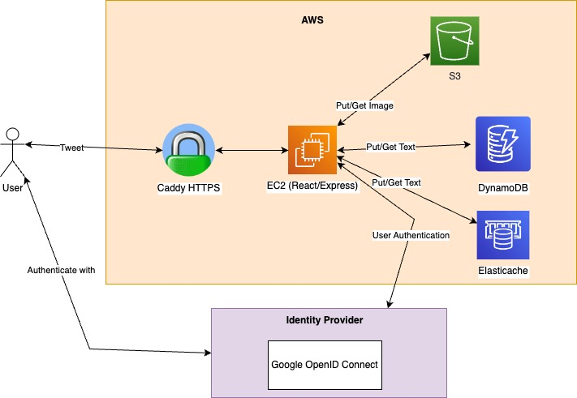

This is a Twitter clone implemented in Typescript!

# Architecture

## Functional Requirements

- Post a new tweet, which can include not only text but also images and URLs
- View one's own profile and the profile of other users
- Follow and unfollow users
- Get a personal feed to view every tweet from the authenticated user and the users that they follow
- View all tweets regardless if you follow that user or not
- Search for other users profiles or for tweets containing a specific term

## Non-functional requirements

- High scalability with minimum latency

## Implementation

- Language: Typescript
- React and Next.js in the frontend
- Express API in the backend
- SSO using OIDC
- Store image files in S3 using Pre-Signed URL
- Use ElasticSearch service for full text search

To simplify deployment, we serve the frontend from our backend.
During development, we use a proxy to run the frontend and backend on the same port.

## UI/UX

#### Profile Page

The profile page contains all user information, from top to bottom:

- the user icon on the top left together with a background image uploaded by the user (or the default background image)
- the username and handle
- the bio, which the user can use to introduce him or herself,
- the location of the user, the link to the personal website (if added) and when the account was created
- the following and followers count

On the top right corner is an "Edit Profile Button" if the profile corresponds to the authenticated user, or a "Follow/Unfollow" Button. The following and followers count link to the Followers/Following Page of that user.

Below the user information, all of the user's tweets are displayed. This requires infinite scrolling.

#### Edit Profile Page

We can change the username, bio, location, website link, profile and background image.

#### Followers/Following Page

On top of the page are two tabs to either show the list of users that follow the authenticated user or the ones that the user follows.

The displayed list is made up of User Cards, that display the profile icon, name, handle and the user's bio. Clicking on the user card leads to the corresponding profile page.

#### News Feed Page

This is the main page of the web app. It has two tabs that allows to toggle between displaying the personal feed (tweets of the people we the user follows) or the global feed (all tweets). This requires infinite scrolling. Tweets are displayed as Tweet Components, showing the username and handle, when the tweet was posted and its content.

#### Search Page

The search page has a search bar on top. Next to the search bar is a send button. Once we enter a term here and press "Send", the results start to appear. Again there is a tab between People and Tweets, with People being the default to select between searching for people (their username or handle) or tweets. The search for results for people is again a User Card component and the results for tweets is a Tweet Component.

#### Header and Footer shared by all pages

The Header contains the twitter logo in the middle.
The Footer is a navigation menu with icons for the news feed page, the search page and the user's profile.
